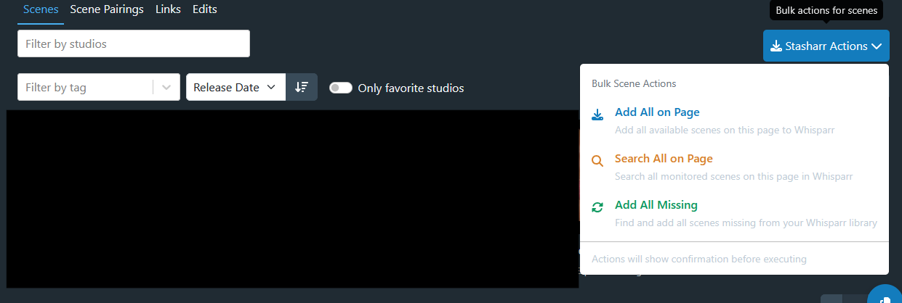

# Stasharr


[](http://commitizen.github.io/cz-cli/)
[](https://github.com/solidjs/solid)

**A powerful userscript that transforms StashDB into your content management hub by seamlessly integrating with Whisparr v3+ and Stash applications.**

Turn StashDB from a simple database into a comprehensive content management system with one-click downloads, bulk operations, and real-time monitoring—all without leaving your browser.

## Features

### **Content Management**

- **One-click Downloads** — Add scenes from StashDB directly to Whisparr with a single click
- **Bulk Operations** — Process entire pages of content with one button press
- **Smart Status Detection** — Visual indicators show which scenes you already have, are downloading, or are excluded
- **Copy Scene IDs** — Floating copy button and inline controls for easy scene identification

### **Seamless Integration**

- **Cross-Platform Navigation** — Jump between StashDB, Whisparr, and Stash with direct links
- **Visual Link Indicators** — Smart badges show when links open in new tabs vs. current tab
- **Reverse Proxy Support** — Full compatibility with `.lan`, `.local`, and custom domain setups
- **Flexible URL Handling** — Smart validation and path preservation for complex hosting configurations

### **Studio & Performer Management**

- **Monitor/Unmonitor** — Toggle monitoring for studios and performers directly from StashDB
- **Real-time Updates** — Instant visual feedback when changes are made
- **Centralized Control** — Manage your entire content pipeline from one interface

### **Advanced Configuration**

- **Link Behavior Control** — Choose whether external links open in new tabs or current tab
- **Smart URL Processing** — Automatic protocol detection (HTTP/HTTPS) based on your setup
- **Comprehensive Settings** — Quality profiles, root folders, tags, and exclusion lists
- **Real-time Validation** — Settings are validated as you type with helpful suggestions

### **User Experience**

- **Progress Modal for Bulk** — Bulk actions use a dedicated modal for progress and summaries
- **Toast Notifications** — Reserved for quick feedback; bulk workflows rely on the modal
- **Responsive Design** — Works seamlessly across all screen sizes
- **Accessibility** — Full keyboard navigation and screen reader support
- **Modern UI** — Clean, intuitive interface that integrates perfectly with StashDB

### **Technical Features**

- **Built with SolidJS** — Fast, reactive, and lightweight (446KB total)
- **TypeScript** — Fully typed for reliability and maintainability
- **Cross-Browser Support** — Compatible with Tampermonkey and Violentmonkey
- **Automatic Updates** — New features and fixes delivered automatically
- **Debug Mode** — Comprehensive logging for troubleshooting

## Installation

### Prerequisites

- **Whisparr v3+** — Ensure you're running the latest version
- **Browser Extension** — Tampermonkey (recommended) or Violentmonkey

### Quick Install

1. **Install browser extension:**
   - [Tampermonkey](https://www.tampermonkey.net/) (recommended)
   - [Violentmonkey](https://violentmonkey.github.io/) (alternative)

2. **Install Stasharr:**

   Click here → [`stasharr.user.js`](https://github.com/enymawse/stasharr/releases/latest/download/stasharr.user.js)

   Your userscript manager will prompt for installation. Click **Install** to proceed.

3. **Automatic updates:**
   Installing via the link above ensures you'll receive updates automatically when new versions are released.

## Configuration

### Initial Setup

1. **Navigate to [StashDB](https://stashdb.org)**
2. **Click "Stasharr"** in the top navigation bar
3. **Configure your settings:**


### Settings Guide

#### **General Settings**

- **Link Behavior** — Choose whether external links open in new tabs (recommended) or current tab
- Visual indicators show which links will open in new tabs

#### **Whisparr Configuration**

- **Domain** — Your Whisparr instance URL
  - Examples: `localhost:6969`, `whisparr.lan`, `whisparr.yourdomain.com:8989`
  - Supports HTTP/HTTPS, custom ports, and reverse proxy setups
- **API Key** — Found in Whisparr → Settings → General
- **Quality Profile** — Auto-populated after successful connection
- **Root Folder** — Auto-populated after successful connection
- **Tags** — Optional tags to apply to downloaded content

#### **Stash Integration** (Optional)

- **Domain** — Your Stash instance URL (same format as Whisparr)
- **API Key** — Found in Stash → Settings → Configuration → Authentication

### Advanced Configuration

#### **Reverse Proxy Users**

Stasharr automatically detects reverse proxy setups and applies smart defaults:

- **Domains ending in** `.lan`, `.local`, `.home`, etc. → Defaults to HTTPS
- **Custom ports** → Optional for reverse proxy domains
- **Path preservation** → Maintains custom paths like `/stash` or `/whisparr`

#### **HTTPS vs HTTP**

- **HTTPS** — Automatically selected for reverse proxy domains and public URLs
- **HTTP** — Used for localhost and private IP addresses
- **Override** — Use the protocol toggle to force HTTP if needed (e.g., for self-signed certificates)

### Permission Requests

When you first configure Whisparr/Stash domains, your browser will request permission to access those sites. **Always click "Always allow domain"** to ensure proper functionality.


## Usage

### Scene Management

Navigate to any scene on StashDB to see Stasharr's enhanced interface:


#### **Status Indicators**

- 🟢 **Green (Downloaded)** — Scene exists in Whisparr with file
- 🟡 **Yellow (Monitored)** — Scene exists in Whisparr, actively searching
- 🔴 **Red (Excluded)** — Scene is on your exclusion list
- 🟣 **Purple (Add)** — Scene not in Whisparr, click to add

#### **Available Actions**

- **Add Scene** — One-click addition to Whisparr
- **View in Whisparr** — Direct link to scene in your Whisparr instance
- **View in Stash** — Direct link to scene in your Stash instance (if configured)
- **Copy Scene ID** — Copy StashDB scene ID to clipboard

### Bulk Operations



On any StashDB page showing multiple scenes, the Stasharr Actions dropdown provides three bulk tools:

- **Add All on Page:** Adds all available scenes on the current page to Whisparr
- **Search All on Page:** Triggers a search for all monitored scenes on the current page in Whisparr
- **Add All Missing:** Finds and adds scenes missing from your Whisparr library based on context (page/studio/performer)

What you’ll see during bulk operations:

- **Progress Modal:** Centralized progress with overall progress bar, per-item status, and final summary
- **Scene Titles:** Items show human-readable scene titles (not hashes)
- **Skipped Info:** Shows how many were skipped with reason “already in Whisparr”
- **Clear Empty-State:** If there’s nothing to do, the modal shows an info message (no false “1/1 succeeded”)
- **Confirmation:** Each action shows a confirmation dialog before executing

### Studio & Performer Management

Visit any studio or performer page to:

- **Toggle monitoring** with the bookmark icon
- **Add new entities** to Whisparr if they don't exist
- **View real-time status** updates

### Settings Management

Access settings anytime by clicking **"Stasharr"** in the top navigation. Settings are:

- **Automatically validated** as you type
- **Saved instantly** when valid
- **Backed up locally** in your browser
- **Synchronized** across tabs

## Troubleshooting

### Common Issues

#### **Settings Won't Save**

- Verify your Whisparr instance is accessible from your browser
- Check that the API key is correct (found in Whisparr → Settings → General)
- Ensure no firewall is blocking the connection

#### **Buttons Not Appearing**

- Refresh the StashDB page
- Check browser console for errors (F12 → Console)
- Verify userscript is enabled in your extension

#### **Permission Denied Errors**

- Re-run the domain permission process in your userscript manager
- Ensure you clicked "Always allow domain" when prompted
- Check that the domain matches exactly (including protocol and port)

#### **Tooltips Stuck on Screen**

- This has been fixed in v2.9.0+
- Update to the latest version if you're experiencing this issue

### Getting Help

#### **Before Reporting Issues**

1. **Update to latest version** — Many issues are resolved in newer releases
2. **Check browser console** — Look for error messages (F12 → Console)
3. **Test basic connectivity** — Verify you can access Whisparr directly in your browser
4. **Review settings** — Ensure all configuration is correct

#### **Whisparr Version Requirements**

Stasharr requires **Whisparr v3+**. If you're running v2, update with:

```bash
docker pull ghcr.io/hotio/whisparr:v3
```

#### **Reporting Bugs**

If you encounter issues, please [create a bug report](https://github.com/enymawse/stasharr/issues/new/choose) with:

- **Stasharr version** — Found in userscript manager
- **Browser & version** — Chrome 120, Firefox 119, etc.
- **Whisparr version** — Found in Whisparr → System → Status
- **Error messages** — From browser console (F12 → Console)
- **Steps to reproduce** — What you were doing when the issue occurred

## Development

Interested in contributing or running your own build? See our [Development Guide](DEVELOPMENT.md) for:

- **Setting up the development environment**
- **Building from source**
- **Contributing guidelines**
- **Architecture overview**

### Tech Stack

- **Frontend** — SolidJS, TypeScript, SCSS
- **Build** — Webpack 5, ESLint, Husky
- **Testing** — Jest (planned)
- **Distribution** — GitHub Actions, Automatic releases

## License

This project is released under the **GNU General Public License v3.0**.

See [LICENSE](LICENSE) for details.

## Credits

**Created by [enymawse](https://github.com/enymawse)**

_Original inspiration from [randybudweiser's stash2whisparr](https://github.com/randybudweiser/stash2whisparr)_

## Support

If Stasharr has improved your content management workflow:

⭐ **Star this repository** to show your support  
🐛 **Report issues** to help improve the project  
💡 **Suggest features** for future development  
🤝 **Contribute** to make Stasharr even better  
🪙 **Donate** by supporing publicly or privately

bitcoin: 3MttRFnUWijmUZ1q5m3ru6gR1ANDWXkSbF

---

_Transform your StashDB experience today with Stasharr — because managing your content library should be effortless._
